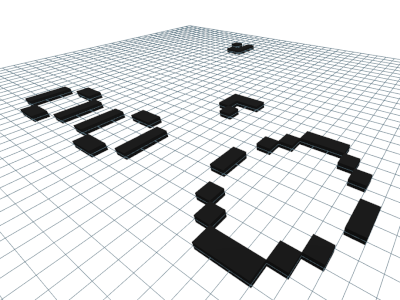

# Conway's Game of Life

> The Game of Life, also known simply as Life, is a cellular automaton devised by the British mathematician John Horton Conway in 1970. It is a zero-player game, meaning that its evolution is determined by its initial state, requiring no further input.

According to [wikipedia](https://en.wikipedia.org/wiki/Conway%27s_Game_of_Life)

This repository contans simple [three.js](https://threejs.org/)-based implementation of the game.

# Preview

# Controls

 - Click to toggle cell state in design mode.
 - Spacebar to start/stop game.
 - Left mouse button + move to orbit around scene.
 - Right mouse button + move to move.

# Usefull Links

- [Three.js site](https://threejs.org/)
